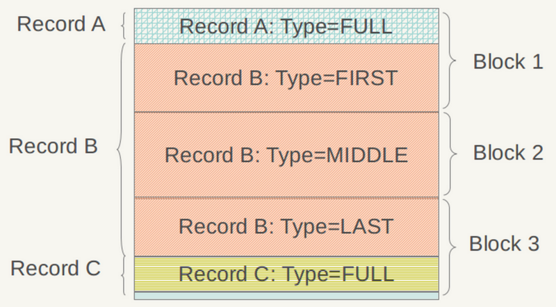
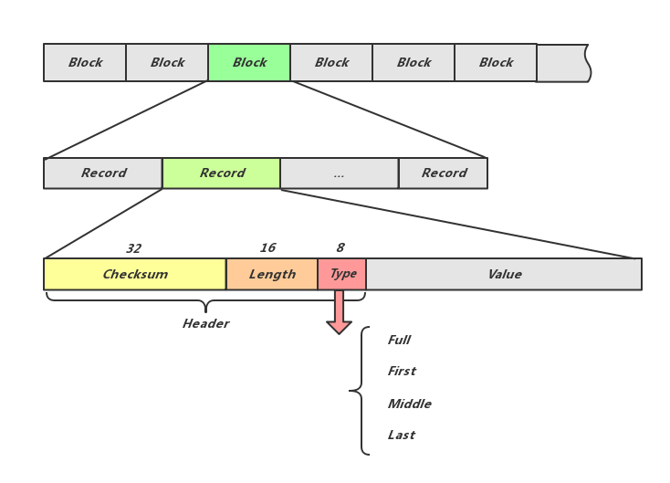

## 1006

- git add 撤销

```
撤销操作

git status 先看一下add 中的文件 
git reset HEAD 如果后面什么都不跟的话 就是上一次add 里面的全部撤销了 
git reset HEAD XXX/XXX/XXX.java 就是对某个文件进行撤销了
```

- git撤销commit，但未git push的命令

```
1、找到之前提交的git commit的id 
    git log 
    找到想要撤销的id 
2、git reset --hard id 
	完成撤销,同时将代码恢复到前一commit_id对应的版本 
3、git reset id 
	完成Commit命令的撤销，但是不对代码修改进行撤销，可以直接通过git commit重新提交对本地代码的修改
```

### PIXELS-分布式缓存方案

1. `Presto Coordination -> Etcd` 
2. `Etcd -> CacheServer` 
3. 

## 1007~1009

### Connector.Split

```
1. 提供的List<HostAddress>作为node节点，作为Stage2的工作节点，策略'isRemotelyAccessible'
2. 

```


- `Presto技术内幕` 查询调度

  ```
  Presto Task是由Stage来调度的，属于执行前调度。执行前调度表示整个查询在真正执行前都已经分配完毕，不会在执行过程中更改task所在的计算节点。
  
  弊端：无法获知当前各个节点的资源使用情况，若调度不当，可能造成某些节点所分配到的Split非常多，导致'数据倾斜'，因此Presto为了避免这种情况，在分配task时采用的策略是尽量使每个节点处理的Split相对均匀。
  
  候选节点的产生过程
  
  获得候选节点，根据规则选择节点分配Split
  ```

  ```
  6.2.2 NodeSelctor -> NodeScheduler 是整个查询调度的核心所在，提供了各个Stage分配Task的具体算法
  
  com.facebook.presto.execution.scheduler.NodeSchedulerConfig
  com.facebook.presto.execution.scheduler.NodeScheduler
  
  Presto查询执行过程 Presto包含三类角色，coordinator,discovery,worker。coordinator负责query的解析和调度。discovery负责集群的心跳和角色管理。worker负责执行
  ```

  

- `System.nanoTime`提供相对精确的计时，但是不能用他来计算当前日期 

- [Guice与Spring的对比](https://baike.baidu.com/item/Guice/3227716?fr=aladdin)

## 1010

### LSM

- https://github.com/indeedeng/lsmtree
- **LSM树**——放弃读能力换取写能力，将多次修改放在内存中形成有序树再统一写入磁盘

https://www.cnblogs.com/bonelee/p/6244810.html


### B tree && B+ tree

https://www.cnblogs.com/vincently/p/4526560.html

https://www.cnblogs.com/lwhkdash/p/5313877.html

```
B树中每一个结点能包含的关键字数有一个上界和下界。这个下界可以用一个称作B树的最小度数（算法导论中文版上译作度数，最小度数即内节点中节点最小孩子数目）t（t>=2）表示。

(1)每个非根的结点必须至少含有t-1个关键字。每个非根的内结点至少有t个子女。如果树是非空的，则根结点至少包含一个关键字；
(2)每个结点可包含之多2t-1个关键字。所以一个内结点至多可有2t个子女。如果一个结点恰好有2t-1个关键字，我们就说这个结点是满的（而稍后介绍的B*树作为B树的一种常用变形，B*树中要求每个内结点至少为2/3满，而不是像这里的B树所要求的至少半满）；
```


## 1016

### SSD

```
1、固态硬盘读写速度快：采用闪存作为存储介质，读取速度相对机械硬盘更快。固态硬盘不用磁头，寻道时间几乎为0。持续写入的速度非常惊人，固态硬盘厂商大多会宣称自家的固态硬盘持续读写速度超过了500MB/s！

2、固态硬盘防震抗摔性好：传统硬盘都是磁碟型的，数据储存在磁碟扇区里。而固态硬盘是使用闪存颗粒（即mp3、U盘等存储介质）制作而成，所以SSD固态硬盘内部不存在任何机械部件。

这样即使在高速移动甚至伴随翻转倾斜的情况下也不会影响到正常使用，而且在发生碰撞和震荡时能够将数据丢失的可能性降到最小。相较传统硬盘，固态硬盘占有绝对优势。 

3、固态硬盘低功耗：固态硬盘的功耗上要低于传统硬盘。

4、固态硬盘无噪音：固态硬盘没有机械马达和风扇，工作时噪音值为0分贝。基于闪存的固态硬盘在工作状态下能耗和发热量较低（但高端或大容量产品能耗会较高）。

内部不存在任何机械活动部件，不会发生机械故障，也不怕碰撞、冲击、振动。由于固态硬盘采用无机械部件的闪存芯片，所以具有了发热量小、散热快等特点。

5、固态硬盘寿命低：固态硬盘闪存具有擦写次数限制的问题，这也是许多人诟病其寿命短的所在。闪存完全擦写一次叫做1次P/E，因此闪存的寿命就以P/E作单位。
```


## 1017-1018

### C++

- explicit

  ```
  C++提供了关键字explicit，可以阻止不应该允许的经过转换构造函数进行的隐式转换的发生,声明为explicit的构造函数不能在隐式转换中使用。
  https://blog.csdn.net/qq_35524916/article/details/58178072
  ```

- virtual

- const

  ```
  修饰成员变量、函数参数、成员函数、函数返回值
  https://www.cnblogs.com/xudong-bupt/p/3509567.html
  ```

  

- leveldb源码解读

[Data Block](https://blog.csdn.net/xuxuan_csd/article/details/72965459)

1.  `table`和`block`的结构 （`table` 就是用来存放多个 `data block` 的，那 `meta block` / `metaindex block` / `index block`的作用）
2.  `data block`前缀压缩 （重启点记录的偏移量怎么计算）
3.  `block `构造方法

[Meta Block](https://blog.csdn.net/xuxuan_csd/article/details/72965499)

1. 一个`meta block`对应一个`data block`，meta block的作用是快速判断对应的data block中是否存在某个key，详情可以搜索“Bloom Filter” 

[sstable](https://blog.csdn.net/xuxuan_csd/article/details/72965513)

[sstable添加key的流程](https://blog.csdn.net/xuxuan_csd/article/details/72965548)


## 1019

- 数据倾斜
  - [MR流程](https://blog.csdn.net/livan1234/article/details/80850343) 
  - **xspace-hadoop ** InvertedIndex.java
- 

## 1020~1025 disease

## 1026

- 分布式锁

  ```
  因为etcd使用Raft算法保持了数据的强一致性，某次操作存储到集群中的值必然是全局一致的，所以很容易实现分布式锁。锁服务有两种使用方式，一是保持独占，二是控制时序。
  ```

  - 保持独占[Atomic Compare-and-Swap](https://www.cnblogs.com/lishijia/p/ETCD.html)

    ```
    etcd为此提供了一套实现分布式锁原子操作CAS（CompareAndSwap）的API。通过设置prevExist值，可以保证在多个节点同时去创建某个目录时，只有一个成功。而创建成功的用户就可以认为是获得了锁。
    ```

  - 控制时序[ POST 自动在目录下创建有序键](https://www.cnblogs.com/doscho/p/6227351.html)

    ```
    即所有想要获得锁的用户都会被安排执行，但是获得锁的顺序也是全局唯一的，同时决定了执行顺序。etcd为此也提供了一套API（自动创建有序键），对一个目录建值时指定为POST动作，这样etcd会自动在目录下生成一个当前最大的值为键，存储这个新的值（客户端编号）。同时还可以使用API按顺序列出所有当前目录下的键值。此时这些键的值就是客户端的时序，而这些键中存储的值可以是代表客户端的编号。
    ```

- 如何实现`分布式读写锁`？

  ```
  读读共享、读写互斥
  	执行compact的进程需要获得写锁，然后修改HDFS上的文件（把ordered目录下的文件删除，把compact之后的文件移到compact目录下），否则等待或者挂起。执行查询的进程，也就是presto connector里面获得读锁，然后才能继续执行，否则等待或者挂起。
  	这个锁可以写成etcdutil里面的一个内部类，比如EtcdUtil.ReadWriteLock之类的。
  ```

## 1027~1028

实现

## 2019

- SSTable -> LSM
- Memtable -> SkipList
- Memp
- 生产者-消费者模式

## 1030

- join() 线程等待
- 完成ETL多线程
- Chubby的锁服务


## 1031

- 操作日志存储与管理

  数据写入Memtable之前，会首先顺序写入Log文件，以避免数据丢失。LevelDB实例启动时会从Log文件中恢复Memtable内容。所以我们对Log的需求是：

  - 磁盘存储
  - 大量的Append操作
  - 没有删除单条数据的操作
  - 遍历的读操作

  LevelDB首先将每条写入数据序列化为一个Record，单个Log文件中包含多个Record。同时，Log文件又划分为固定大小的Block单位。对于一个log文件，LevelDB会把它切割成以32K为单位的物理Block（可以做Block Cache），并保证Block的开始位置一定是一个新的Record。这种安排使得发生数据错误时，最多只需丢弃一个Block大小的内容。显而易见地，不同的Record可能共存于一个Block，同时，一个Record也可能横跨几个Block。

 

```
Block := Record * N
Record := Header + Content
Header := Checksum + Length + Type
Type := Full or First or Midder or Last
```

 

Log文件划分为固定长度的Block，每个Block中包含多个Record；Record的前56个字节为Record头，包括32位checksum用做校验，16位存储Record实际内容数据的长度，8位的Type可以是Full、First、Middle或Last中的一种，表示该Record是否完整的在当前的Block中，如果不是则通过Type指明其前后的Block中是否有当前Record的前驱后继。 