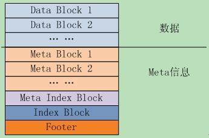
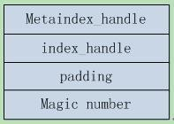

## 1101

- Leveldb

```
特点：
1、key和value都是任意长度的字节数组；
2、entry（即一条K-V记录）默认是按照key的字典顺序存储的，当然开发者也可以重载这个排序函数；
3、提供的基本操作接口：Put()、Delete()、Get()、Batch()；
4、支持批量操作以原子操作进行；
5、可以创建数据全景的snapshot(快照)，并允许在快照中查找数据；
6、可以通过前向（或后向）迭代器遍历数据（迭代器会隐含的创建一个snapshot）；
7、自动使用Snappy压缩数据；
8、可移植性；

限制：
1、非关系型数据模型（NoSQL），不支持sql语句，也不支持索引；
2、一次只允许一个进程访问一个特定的数据库；
3、没有内置的C/S架构，但开发者可以使用LevelDB库自己封装一个server；
```

- SSTable

 

大致分为几个部分：

- 数据块 Data Block，直接存储有序键值对
- Meta Block，存储Filter相关信息
- Meta Index Block，对Meta Block的索引，它只有一条记录，key是meta index的名字（也就是Filter的名字），value为指向meta index的位置。
- Index Block，是对Data Block的索引，对于其中的每个记录，其key >=Data Block最后一条记录的key，同时<其后Data Block的第一条记录的key；value是指向data index的位置信息
- Footer，指向各个分区的位置和大小，示意图如下：

 


## 1102~1103

- Version 版本控制


## 1104

