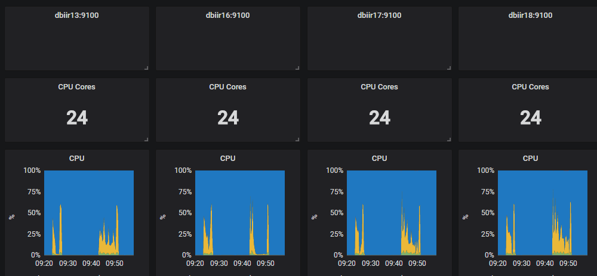
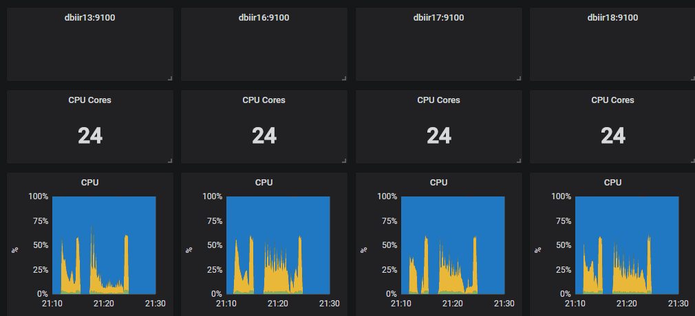
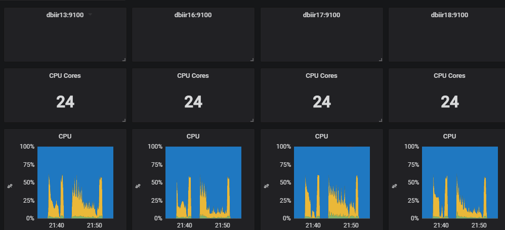
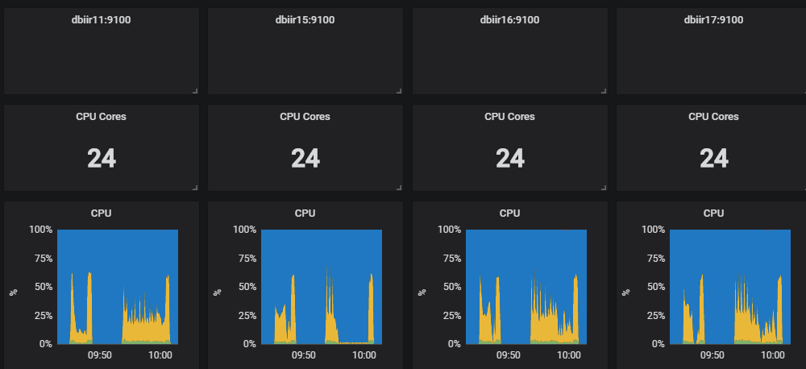

## 1225

- Pixels_BatchSize：10000

2018-12-25 09:20:00

2018-12-25 09:58:00

Pixels_BatchSize：1024

2018-12-25 21:10:00

2018-12-25 21:30:00

- 25000

2018-12-25 21:35:00

2018-12-25 21:55:00

- 1024+Log

2018-12-26 09:43:00

2018-12-26 10:03:00

pixels的map个数是338，reduce是363，  orc的分别是320、367

pixels的map个数是85，reduce是363，  orc的分别是320、367

320 * 256M = 80G