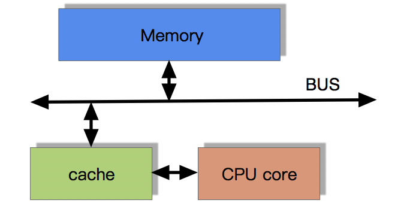
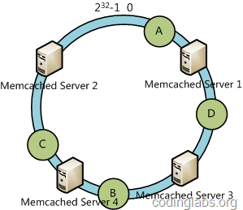

- HashMap
  - Resize（扩容+ReHash）
  - 高并发ReHash出现链表环，导致CPU100%

- TreeMap（用于排序，红黑树）

- ConcurrentHashmap

  ```
  JDK 1.6版本关键要素：
  
  1. segment继承了ReentrantLock充当锁的角色，为每一个segment提供了线程安全的保障；
  2. segment维护了哈希散列表的若干个桶，每个桶由HashEntry构成的链表。
  ```

  ```
  JDK 1.8的ConcurrentHashMap就有了很大的变化，光是代码量就足足增加了很多。1.8版本舍弃了segment，并且大量使用了synchronized，以及CAS无锁操作以保证ConcurrentHashMap操作的线程安全性。至于为什么不用ReentrantLock而是Synchronzied呢？实际上，synchronzied做了很多的优化，包括偏向锁，轻量级锁，重量级锁，可以依次向上升级锁状态，但不能降级，因此，使用synchronized相较于ReentrantLock的性能会持平甚至在某些情况更优，具体的性能测试可以去网上查阅一些资料。另外，底层数据结构改变为采用数组+链表+红黑树的数据形式。
  ```

  ```
  1.因为攻击者可以构造大量具有相同hashCode的内容，使其全部放在同一个列表中，这样，在查找的时候，所花费的时间会很长。这个时候，如果采用红黑树这个结构来进行存储，那么其查找的效率会高很多。 
  2.hashCode()函数的计算有时候并不合理，例如重写hashCode函数的时候。如果都映射到同一个位置，那么查找的时间也会很长。
  ```

  

- HashTable

  支持线程的同步，即任一时刻只有一个线程能写Hashtable，因此也导致了 Hashtable在写入时会比较慢

- TLongIntHashMap -> TSortLongIntHashMap

  轻量级<long, int>，int[] _values保存value

  HashFunctions.hash(val) & (2147483647)

  ```
  TSortLongIntHashMapl类
  快排优化：三数取中选择枢轴+插排(+聚集相等元素)
  https://blog.csdn.net/a15920804969/article/details/80172343
  
  ```


- 排序算法（https://blog.csdn.net/yushiyi6453/article/details/76407640）


```
注：
1 归并排序可以通过手摇算法将空间复杂度降到O（1），但是时间复杂度会提高。
2 基数排序时间复杂度为O（N*M），其中N为数据个数，M为数据位数。
```

- 辅助记忆
  1）时间复杂度记忆- 

  ```
  冒泡、选择、直接排序需要两个for循环，每次只关注一个元素，平均时间复杂度为O（n2）（一遍找元素O(n)，一遍找位置O(n)）
  快速、归并、希尔、堆基于二分思想，log以2为底，平均时间复杂度为O(nlogn)（一遍找元素O(n)，一遍找位置O(logn)）
  ```

  2）稳定性记忆-“快希选堆”（快牺牲稳定性） 
  排序算法的稳定性：排序前后相同元素的相对位置不变，则称排序算法是稳定的；否则排序算法是不稳定的。

- [快速排序](https://www.cnblogs.com/redbear/p/8891730.html)

  ```
  int findPosition(int array[], int left, int right) {
  	int baseKey = array[left];
  	while (left < right) {
  		while (left < right && array[right] >= baseKey) right--;
  		if (left < right) array[left++] = array[right];
  		while (left < right && array[left] <= baseKey) left++;
  		if (left < right) array[right--] = array[left];
  	}
  	array[left] = baseKey;
  	return left;
  }
  
  void quickSort(int array[], int left, int right) {
  	if (left >= right) return ;
  	int pos = findPosition(array, left, right);
  	quickSort(array, left, pos - 1);
  	quickSort(array, pos + 1, right);
  }
  
  void main(){
  	quickSort(array, 0, array.length - 1);
  }
  ```

  

- 直接插入排序 O(n2)

  ```
  插入排序从小到大排序：首先位置1上的数和位置0上的数进行比较，如果位置1上的数小于位置0上的数，将位置0上的数向后移一位，将1插入到0位置，否则不处理。位置k上的数和之前的数依次进行比较，如果比位置K上的数大，将之前的数向后移位，最后将位置k上的数插入不满足条件点，反之不处理。
  //array[]为待排序数组，n为数组长度
  // 正序
  void insertSort(int array[], int n){
      int i,j,temp;
      for( i=1;i<n;i++){
          if(array[i]<array[i-1]){
              temp=array[i];
              for( j=i; j>=1 && array[j-1]>temp; j--){
                  array[j]=array[j-1];
              }
              array[j]=temp;
          }
      }
  }
  
  从数组的第二个元素开始遍历，将该元素与前面的元素比较，如果该元素比前面的元素小，将该元素保存进临时变量中，依次将前面的元素后移，然后将该元素插入到合适的位置。每次排序完成后，索引左边的元素一定是有序的，但是还可以移动。对于倒置越少的数组，该算法的排序效率越高。
  for(int i=1;i<array.length;i++){
              for(int j=i; j>0&&array[j]<array[j-1]; j--){
                  int temp=array[j];
                  array[j]=array[j-1];
                  array[j-1]=temp;
              }
          }
  ```

- 选择排序 O(n2) 

  ```
  选择排序从小到大排序：一开始从0~n-1区间上选择一个最小值，将其放在位置0上，然后在1~n-1范围上选取最小值放在位置1上。重复过程直到剩下最后一个元素，数组即为有序。
  //array[]为待排序数组，n为数组长度
  void selectSort(int array[], int n){
      int i, j, min, k;
      for( i=0; i<n-1; i++){
          min=i; //每趟排序最小值先等于第一个数，遍历剩下的数
          for( j=i+1; j<n; j++) //从i下一个数开始检查
          {
              if(array[min]>array[j]){
                  min=j;
              }
          }
          if(min!=i){
              k=array[min];
              array[min]=array[i];
              array[i]=k;
          }
      }
  }
  
  从待排序的数组中选择一个最小的元素，将它与数组的第一个位置的元素交换位置。然后从剩下的元素中选择一个最小的元素，将它与第二个位置的元素交换位置，如果最小元素就是该位置的元素，就将它和自身交换位置，依次类推，直到排序完成。
  ```

- 冒泡排序 O(n2) 

  ```
  冒泡排序从小到大排序：一开始交换的区间为0~N-1，将第1个数和第2个数进行比较，前面大于后面，交换两个数，否则不交换。再比较第2个数和第三个数，前面大于后面，交换两个数否则不交换。依次进行，最大的数会放在数组最后的位置。然后将范围变为0~N-2，数组第二大的数会放在数组倒数第二的位置。依次进行整个交换过程，最后范围只剩一个数时数组即为有序。
  //array[]为待排序数组，n为数组长度
  // 正序
  void BubbleSort(int array[], int n){
      int i, j, k;
      for(i=0; i<n-1; i++)
          for(j=0; j<n-1-i; j++){
              if(array[j]>array[j+1]){
                  k=array[j];
                  array[j]=array[j+1];
                  array[j+1]=k;
              }
          }
  }
  
  // 逆序
  for(int i = 0; i < n; i++){
      for(int j = n-1; j > i; j--){
      	if(array[j-1] < array[j]){
              swap(array, j, j-1);
      	}
      }
  }
  ```

- 归并排序

  ```
  归并排序从小到大排序：首先让数组中的每一个数单独成为长度为1的区间，然后两两一组有序合并，得到长度为2的有序区间，依次进行，直到合成整个区间。
  
  ```

- 堆排序

- 桶排序（基数排序的思想）

  ```
  桶排序是计数排序的变种，把计数排序中相邻的m个”小桶”放到一个”大桶”中，在分完桶后，对每个桶进行排序（一般用快排），然后合并成最后的结果。
  ```

  

- 希尔排序

  ```
  希尔排序是插入排序改良的算法，希尔排序步长从大到小调整，第一次循环后面元素逐个和前面元素按间隔步长进行比较并交换，直至步长为1，步长选择是关键。
  ```

- 排序稳定性


如果排序算法稳定，对基于比较的排序算法而言，元素交换的次数可能会少一些


## 面试经历-头条

- 网络模型

  OSI七层参考模型和TCP/IP四层参考模型（[应用层-传输层-网络层-网络接口层](https://baijiahao.baidu.com/s?id=1594188428907146217&wfr=spider&for=pc)）


  ```
	传输层通过位于该层的TCP协议（传输控制协议）或UDP协议（用户数据报协议）在两台主机间传输数据。其中TCP协议提供可靠的面向连接的服务，它保证数据能完整地按顺序地传送到目标计算机。它在传输数据前首先需要和目的计算机建立连接，并且在数据传输过程中维持此链接，因此在速度上会有些损失。UDP提供简单的无连接服务，它不保证数据能按顺序、正确地传送到目的地（但可由他的上层来保证），它不用建立连接，通常速度上要比TCP快些。TCP协议和IP协议都需要网络层提供通往目的地的路由。传输层提供端到端，即应用程序之间的通信。该层的主要功能有差错控制、传输确认和丢失重传等。
  ```

- Socket建立通信（TCP/IP的编程抽象就是Socket）

  

  ```
  一个IO操作其实分成了两个步骤：发起IO请求和实际的IO操作
  （1）阻塞IO和非阻塞IO的区别在于第一步：发起IO请求是否会被阻塞，如果阻塞直到完成那么就是传统的阻塞IO;如果不阻塞，那么就是非阻塞IO
  （2）同步IO和异步IO的区别就在于第二个步骤是否阻塞，如果实际的IO读写阻塞请求进程，那么就是同步IO，因此阻塞IO、非阻塞IO、IO复用、信号驱动IO都是同步IO;如果不阻塞，而是操作系统帮你做完IO操作再将结果返回给你，那么就是异步IO
  ```

  [Reactor模型](https://www.cnblogs.com/ivaneye/p/5731432.html)

  

- 同步阻塞模型，同步非阻塞模型，IO多路复用模型（select/poll, epoll），信号驱动IO模型和异步IO模型（[五种IO模型](https://blog.csdn.net/aaa_cainiao_66666/article/details/87916884)）

  select优缺点：

  - 优点：

      1.单个进程就可以完成并发工作，更轻量，比较容易实现
      2.并发量较小，局域网应用，使用select比较理想
      3.如果要求监听事件，并且对时间精度要求较高，可以使用select

  - 缺点：

      1.select的监听数量受限于FD_SIZE大小，只能在1024以内
      2.select监听事件采用轮询的方式，这就导致，轮询数量增加，处理和·响应效率呈线性下降
      3.select可以实现单个进程完成并发，但必须对服务流程有严格的限制要求（服务不可过于复杂，时间不能过长）
      4.没有将传入传出分离
      5.每次都要重新准备监听集合，并且将集合传入到内核监听设备中，这种重复没有意义，浪费系统开销
      6.select只会传出就绪的数量，以及监听集合，并不会直接将就绪的socket进行反馈 这就导致找出就绪的socket过程比较麻烦。
  **epoll**是Linux内核为处理大批量文件描述符而作了改进的poll，是Linux下多路复用IO接口select/poll的增强版本，它能显著提高程序在大量并发连接中只有少量活跃的情况下的系统CPU利用率。

  

  相比于select，epoll最大的好处在于它不会随着监听fd数目的增长而降低效率。因为在内核中的select实现中，它是采用轮询来处理的，轮询的fd数目越多，自然耗时越多 

- 归并排序

  ```
  
  ```

  

- 长度为n的字符串中第一个出现且只出现一次的字符

  LinkedHashMap

  ```
  LinkedHashMap也是一个HashMap,但是内部维持了一个双向链表,可以保持顺序
  ```

  FIFO： LinkedHashMap的一个构造函数，传入的第三个参数accessOrder为false（默认）

  LRU：

  ```
  为了使得到达设置缓存大小不会进行自动扩容，需要将初始化的大小进行计算再传入，可以将初始化大小设置为(缓存大小 / loadFactor) + 1，这样就可以在元素数目达到缓存大小时，也不会进行扩容了。
  
  public LRU1(int cacheSize) {
  	MAX_CACHE_SIZE = cacheSize;
  	int capacity = (int)Math.ceil(MAX_CACHE_SIZE / DEFAULT_LOAD_FACTORY) + 1;
  	/*
  	 * 第三个参数设置为true，代表linkedlist按访问顺序排序，可作为LRU缓存
  	 * 第三个参数设置为false，代表按插入顺序排序，可作为FIFO缓存
  	 */
  	map = new LinkedHashMap<K, V>(capacity, DEFAULT_LOAD_FACTORY, true) {
  		@Override
  		protected boolean removeEldestEntry(Map.Entry<K, V> eldest) {
  			return size() > MAX_CACHE_SIZE;
  		}
  	};
  }
  ```

- LinkedBlockingQueue阻塞队列 & ConcurrentBlockingQueue非阻塞队列

  ​	有两个比较相似的并发阻塞队列，LinkedBlockingQueue和LinkedBlockingDeque，两个都是队列，只不过前者只能一端出一端入，后者则可以两端同时出入，并且都是结构改变线程安全的队列。其实两个队列从实现思想上比较容易理解，有以下特点：

  1）链表结构（动态数组）

  2）通过ReentrantLock实现锁

  3）利用Condition实现队列的阻塞等待，唤醒。

  ```
  对于LinkedBlockingDeque，和ArrayBlockingQueue结构还是很类似的，也是一个ReentrantLock和两个Condition使用，但是仅仅是在这二者使用上，其实内部运转还是很大不同的。
  ```

  

- CPU缓存级别

  

  cpu的频率太快了，快到主存跟不上，这样在处理器时钟周期内，cpu常常需要等待主存，浪费资源。cache的出现，是**为了缓解cpu和主存之间速度的不匹配问题**（结构：cpu->cache>memory）

  1、时间局部性：如果某个数据被访问，那么在不久的将来它很可能被再次访问；

  2、空间局部性：如果某个数据被访问，那么与它相邻的数据很快也可能被访问；

  L1缓存为32K，L2缓存为256K，L3缓存为2M

  ```
  各种缓存级别在设计方式上有很大差异；它们受到不同的限制并满足不同的目的。根据经验，当您爬上缓存层次结构的级别时，缓存会变得更大，更慢，密度更高（每单位面积存储的位数更多），每位存储的功耗更低，并获得额外的任务。
  ```

- 伪共享

  Cache内部按行存储（Cache Line），是cache与主内存进行数据交互的单位，为2的幂次方字节

  当多个线程同时修改一个缓存行里的多个变量时，

  方法：字节填充（sun.misc.Contended注解），避免多个变量存放在同一个缓存行

- ThreadLocal与Synchonized的对照

  ```
  ThreadLocal和Synchonized都用于解决多线程并发访问。可是ThreadLocal与synchronized有本质的差别。synchronized是利用锁的机制，使变量或代码块在某一时该仅仅能被一个线程访问。而ThreadLocal为每个线程都提供了变量的副本，使得每个线程在某一时间访问到的并非同一个对象，这样就隔离了多个线程对数据的数据共享。而Synchronized却正好相反，它用于在多个线程间通信时可以获得数据共享。
   
  Synchronized用于线程间的数据共享，而ThreadLocal则用于线程间的数据隔离。
  ```

- 并发容器

  - CPU缓存一致性协议（MSEI）

    CPU缓存不一致的办法：通过给总线加锁（虽然也达到了目的，但是在总线被锁住的期间，其他的CPU也无法访问主存，**效率很低**）、使用缓存一致性协议

    **核心思想**是，当CPU写数据时候，如果发现操作的变量是共享变量(即其他CPU上也存在该变量)，就会发出信号通知**其他CPU**将它高速缓存中缓存这个变量的缓存行置为**无效状态**，因此当其他CPU需要读取这个变量时，发现自己高速缓存中缓存该变量的缓存行为无效状态，那么它就会从主存中**重新读取**。

  

  

  - 带有高速缓存的CPU执行计算的流程
    1.  程序以及数据被加载到主内存
    2. 指令和数据被加载到CPU的高速缓存
    3. CPU执行指令，把结果写到高速缓存
    4. 高速缓存中的数据写回主内存

  

  - CAS的优缺点

    优点：高效的解决原子操作

    缺点：ABA问题，循环时间长开销大和只能保证一个共享变量的原子操作

    ABA：线程1对A操作CAS之前，线程2已经实现A-B-A操作，导致前后的A并不是相同的，通过时间戳保证状态值

  - synchronized的锁膨胀

    偏向锁->轻量级锁->重量级锁

  - JMM（Java内存模型，Java Memory Model）

    https://blog.csdn.net/v123411739/article/details/79438066

    ```
    	Java内存模型的主要目标是定义程序中各个变量的访问规则，即在虚拟机中将变量存储到内存和从内存中取出变量这样的底层细节。此处的变量（Variables）与Java编程中所说的变量有所区别，它包括了实例字段、静态字段和构成数组对象的元素，但不包括局部变量与方法参数，因为后者是线程私有的，不会被共享，自然就不会存在竞争问题。
    	Java内存模型规定了所有的变量都存储在主内存（Main Memory）中。每条线程还有自己的工作内存（Working Memory，可与前面讲的处理器高速缓存类比），线程的工作内存中保存了被该线程使用到的变量的主内存副本拷贝，线程对变量的所有操作（读取、赋值等）都必须在工作内存中进行，而不能直接读写主内存中的变量。不同的线程之间也无法直接访问对方工作内存中的变量，线程间变量值的传递均需要通过主内存来完成，线程、主内存、工作内存三者的交互关系如图所示。
    ```

    

  - G1 GC和CMS G1

    

  - 禁用偏向锁的优缺点

    偏向锁的目的是为了在无锁竞争的情况下避免在锁获取过程中执行不必要的CAS原子指令；现有的CAS原子指令虽然相对于重量级锁来说开销比较小但还是存在非常可观的本地延迟。而偏向锁则针对拥有当前锁的线程，允许其在竞争不存在的情况下，直接进入同步的代码块，无需同步操作，从而获取了相当的性能提升。

    

  - JIT编译规则（just in time）（***JIT编译是动态编译的一种特例***）

    https://blog.csdn.net/sunxianghuang/article/details/52094859

    ```
    在Java的编译体系中，一个Java的源代码文件变成计算机可执行的机器指令的过程中，需要经过两段编译，第一段是把.java文件转换成.class文件。第二段编译是把.class转换成机器指令的过程。
    
    javac指令 将java源码变为 java字节码的静态编译过程。
    java字节码编译为 本地机器码的过程，并且因为这个过程是在程序运行时期完成的所以称之为即时编译。
    
    JVM 通过解释字节码将其翻译成对应的机器指令，逐条读入，逐条解释翻译。很显然，经过解释执行，其执行速度必然会比可执行的二进制字节码程序慢很多。这就是传统的JVM的解释器（Interpreter）的功能。为了解决这种效率问题，引入了 JIT（即时编译） 技术。Java程序还是通过解释器进行解释执行，当JVM发现某个方法或代码块运行特别频繁的时候，就会认为这是“热点代码”（Hot Spot Code)。然后JIT会把部分“热点代码”翻译成本地机器相关的机器码，并进行优化，然后再把翻译后的机器码缓存起来，以备下次使用。
    ```

    

  - [volatile](https://blog.csdn.net/v123411739/article/details/79438066)内存语义，内存屏障

    ```
    	Java内存模型是通过在变量修改后将新值同步回主内存，在变量读取前从主内存刷新变量值这种依赖主内存作为传递媒介的方式来实现可见性的，无论是普通变量还是volatile变量都是如此，普通变量与volatile变量的区别是，volatile的特殊规则保证了新值能立即同步到主内存，以及每次使用前立即从主内存刷新。因此，可以说volatile保证了多线程操作时变量的可见性，而普通变量则不能保证这一点。
    ```

    ```
    	可以通过插入内存屏障指令来禁止特定类型的处理器重排序。
    	通过对比加入volatile和未加入volatile关键字所生成的汇编代码就会发现，关键变化在于有volatile修饰的变量，赋值后多执行了一个“lock addl $0x0,(%esp)”操作，这个操作相当于一个内存屏障（Memory Barrier或Memory Fence，指重排序时不能把后面的指令重排序到内存屏障之前的位置），只有一个CPU访问内存时，并不需要内存屏障；但如果有两个或更多CPU访问同一块内存，且其中有一个在观测另一个，就需要内存屏障来保证一致性了。
    ```

    **重排序**是指编译器和处理器为了优化程序性能而对指令序列进行重新排序的一种手段。

    - 保证此变量对所有线程的可见性，即当一条线程修改了这个变量的值，新值对于其他线程来说是可以立即得知的

    - 禁止指令重排序优化

      ```
      	关于volatile变量的可见性，经常会被开发人员误解，认为以下描述成立：“volatile变量对所有线程是立即可见的，对volatile变量所有的写操作都能立刻反应到其他线程之中，换句话说，volatile变量在各个线程中是一致的，所以基于volatile变量的运算在并发下是安全的”。这句话的论据部分并没有错，但是其论据并不能得出“基于volatile变量的运算在并发下是安全的”这个结论。volatile变量在各个线程的工作内存中不存在一致性问题，但是Java里面的运算并非原子操作，并且volatile并不能保证原子性，导致volatile变量的运算在并发下一样是不安全的。
      ```

    **使用限制**

    ```
    	由于volatile变量只能保证可见性，在不符合以下两条规则的运算场景中，我们仍然要通过加锁（使用synchronized或java.util.concurrent中的原子类）来保证原子性。
    ```

    - 运算结果并不依赖变量的当前值，或者能够确保只有单一的线程修改变量的值。
    - 变量不需要与其他的状态变量共同参与不变约束。

    **使用场景**

    - 状态标记量

      ```
      	使用volatile来修饰状态标记量，使得状态标记量对所有线程是实时可见的，从而保证所有线程都能实时获取到最新的状态标记量，进一步决定是否进行操作。例如常见的促销活动“秒杀”，可以用volatile来修饰“是否售罄”字段，从而保证在并发下，能正确的处理商品是否售罄。
      ```

    - 双重检测机制实现单例

      ```
      	普通的双重检测机制在极端情况，由于指令重排序会出现问题，通过使用volatile来修饰instance，禁止指令重排序，从而可以正确的实现单例。
      public class Singleton {
          // 私有化构造函数
          private Singleton() {}  
          // volatile修饰单例对象
          private static volatile Singleton instance = null;   
          public static Singleton getInstance() { // 对外提供的工厂方法
              if (instance == null) {     // 第一次检测
                  synchronized (Singleton.class) {    // 同步锁
                      if (instance == null) { // 第二次检测
                          instance = new Singleton(); // 初始化
                      }
                  }
              }
              return instance;
          }
      }
      memory = allocate（）;    // 1.分配对象的内存空间
      ctorInstance（memory）;    // 2.初始化对象
      instance = memory;    // 3.设置instance指向刚才分配的内存地址
      // 重排序之后
      memory = allocate（）;    // 1.分配对象的内存空间
      instance = memory;    // 3.设置instance指向刚才分配的内存地址
      ctorInstance（memory）;    // 2.初始化对象
      ```

    **总结**

    - 每个线程有自己的工作内存，工作内存中的数据并不会实时刷新回主内存，因此在并发情况下，有可能线程A已经修改了成员变量k的值，但是线程B并不能读取到线程A修改后的值，这是因为线程A的工作内存还没有被刷新回主内存，导致线程B无法读取到最新的值。
    - 在工作内存中，每次使用volatile修饰的变量前都必须先从主内存刷新最新的值，这保证了当前线程能看见其他线程对volatile修饰的变量所做的修改后的值。
    - 在工作内存中，每次修改volatile修饰的变量后都必须立刻同步回主内存中，这保证了其他线程可以看到自己对volatile修饰的变量所做的修改。
    - volatile修饰的变量不会被指令重排序优化，保证代码的执行顺序与程序的顺序相同。
    - volatile保证可见性，不保证原子性，部分保证有序性（仅保证被volatile修饰的变量）。
    - 指令重排序的目的是为了提高性能，指令重排序仅保证在单线程下不会改变最终的执行结果，但无法保证在多线程下的执行结果。
    - 为了实现volatile的内存语义，编译器在生成字节码时，会在指令序列中插入内存屏障来禁止重排序。

- rocksdb对leveldb的优化

- leveldb文件结构

- 机械硬盘和固态硬盘的对比，速度数量级，写放大和读放大

- B+树

- 阻塞队列和非阻塞队列 怎么实现（LinkedBlockingQueue与ConcurrentBlockingQueue）

  一个用的是AQS的同步队列和等待队列，一个用的是链表+CAS

- 自实现锁（自旋Semaphore）


## 总结

- Map

**java为数据结构中的映射定义了一个接口java.util.Map;它有四个实现类,分别是HashMap Hashtable LinkedHashMap 和TreeMap.**

Map主要用于存储健值对，根据键得到值，因此不允许键重复(重复了覆盖了),但允许值重复。
（1）Hashmap 是一个最常用的Map,它根据键的HashCode值存储数据,根据键可以直接获取它的值，具有很快的访问速度，遍历时，取得数据的顺序是完全随机的。 HashMap最多只允许一条记录的键为Null;允许多条记录的值为 Null;HashMap不支持线程的同步，即任一时刻可以有多个线程同时写HashMap;可能会导致数据的不一致。如果需要同步，可以用 Collections的synchronizedMap方法使HashMap具有同步的能力，或者使用ConcurrentHashMap。

（2）Hashtable与 HashMap类似,它继承自Dictionary类，不同的是:它不允许记录的键或者值为空;

**它支持线程的同步，即任一时刻只有一个线程能写Hashtable,因此也导致了 Hashtable在写入时会比较慢。**

（3）LinkedHashMap 是HashMap的一个子类，**保存了记录的插入顺序**，在用Iterator遍历LinkedHashMap时，先得到的记录肯定是先插入的.也可以在构造时用带参数，按照应用次数排序。在遍历的时候会比HashMap慢，不过有种情况例外，当HashMap容量很大，实际数据较少时，遍历起来可能会比 LinkedHashMap慢，因为LinkedHashMap的遍历速度只和实际数据有关，和容量无关，而HashMap的遍历速度和他的容量有关。

（4）TreeMap实现SortMap接口，**能够把它保存的记录根据键排序,默认是按键值的升序排序**，也可以指定排序的比较器，当用Iterator 遍历TreeMap时，得到的记录是排过序的。

1> 区别 （https://www.cnblogs.com/acm-bingzi/p/javaMap.html）

一般情况下，我们用的最多的是HashMap,在Map 中插入、删除和定位元素，HashMap 是最好的选择。但如果您要按自然顺序或自定义顺序遍历键，那么TreeMap会更好。如果需要输出的顺序和输入的相同,那么用LinkedHashMap 可以实现,它还可以按读取顺序来排列.

HashMap是一个最常用的Map，它根据键的hashCode值存储数据，根据键可以直接获取它的值，具有很快的访问速度。HashMap最多只允许一条记录的键为NULL，允许多条记录的值为NULL。

HashMap不支持线程同步，即任一时刻可以有多个线程同时写HashMap，可能会导致数据的不一致性。如果需要同步，可以用Collections的synchronizedMap方法使HashMap具有同步的能力。

Hashtable与HashMap类似，不同的是：它不允许记录的键或者值为空；它支持线程的同步，即任一时刻只有一个线程能写Hashtable，因此也导致了Hashtable在写入时会比较慢。

LinkedHashMap保存了记录的插入顺序，在用Iterator遍历LinkedHashMap时，先得到的记录肯定是先插入的。

在遍历的时候会比HashMap慢TreeMap能够把它保存的记录根据键排序，默认是按升序排序，也可以指定排序的比较器。当用Iterator遍历TreeMap时，得到的记录是排过序的。


## 0226 

- 线程池

- DP

- NIO

  ```
  （Non-blocking I/O，在Java领域，也称为New I/O），是一种同步非阻塞的I/O模型，也是I/O多路复用的基础，已经被越来越多地应用到大型应用服务器，成为解决高并发与大量连接、I/O处理问题的有效方式。
  ```

  

- JVM


## 0227

**空间复杂度**是对一个算法在运行过程中临时占用存储空间大小的量度。

如当一个算法的空间复杂度为一个常量，即不随被处理数据量n的大小而改变时，可表示为O(1)。

- [一致性哈希算法](http://blog.codinglabs.org/articles/consistent-hashing.html) + 公众号

  Q：最简单的策略是将每一次Memcached**请求随机**发送到一台Memcached服务器，但是这种策略可能会带来两个问题：一是**同一份数据可能被存在不同的机器上而造成数据冗余**，二是**有可能某数据已经被缓存但是访问却没有命中**，因为无法保证对相同key的所有访问都被发送到相同的服务器。因此，随机策略无论是时间效率还是空间效率都非常不好。

  A：保证对相同key的访问会被发送到相同的服务器。很多方法可以实现这一点，最常用的方法是**计算哈希**。

`h = Hash(key) % N`

这个算式计算每个key的请求应该被发送到哪台服务器，其中N为服务器的台数，并且服务器按照0 – (N-1)编号。

这个算法的问题在于容错性和扩展性不好。所谓**容错性**是指当系统中某一个或几个服务器变得不可用时，整个系统是否可以正确高效运行；而**扩展性**是指当加入新的服务器后，整个系统是否可以正确高效运行。

一致性哈希将整个哈希值空间组织成一个虚拟的圆环，如假设某哈希函数H的值空间为0 - 2^32-1（即哈希值是一个32位无符号整形），整个哈希空间环如下：


例如我们有A、B、C、D四个数据对象，经过哈希计算后，在环空间上的位置如下：


根据一致性哈希算法，数据A会被定为到Server 1上，D被定为到Server 3上，而B、C分别被定为到Server 2上。

## 容错性与可扩展性分析

下面分析一致性哈希算法的容错性和可扩展性。现假设Server 3宕机了：


可以看到此时A、C、B不会受到影响，只有D节点被重定位到Server 2。一般的，在一致性哈希算法中，如果一台服务器不可用，则受影响的数据仅仅是此服务器到其环空间中前一台服务器（即顺着逆时针方向行走遇到的第一台服务器）之间数据，其它不会受到影响。

下面考虑另外一种情况，如果我们在系统中增加一台服务器Memcached Server 4：



此时A、D、C不受影响，只有B需要重定位到新的Server 4。一般的，在一致性哈希算法中，如果增加一台服务器，则受影响的数据仅仅是新服务器到其环空间中前一台服务器（即顺着逆时针方向行走遇到的第一台服务器）之间数据，其它不会受到影响。

综上所述，一致性哈希算法对于节点的增减都只需重定位环空间中的一小部分数据，具有较好的容错性和可扩展性。


- 虚拟节点 

  一致性哈希算法在服务节点太少时，容易因为节点分部不均匀而造成数据倾斜问题。例如我们的系统中有两台服务器，其环分布如下：

  

  此时必然造成大量数据集中到Server 1上，而只有极少量会定位到Server 2上。为了解决这种数据倾斜问题，一致性哈希算法引入了虚拟节点机制，即对每一个服务节点计算多个哈希，每个计算结果位置都放置一个此服务节点，称为虚拟节点。具体做法可以在服务器ip或主机名的后面增加编号来实现。例如上面的情况，我们决定为每台服务器计算三个虚拟节点，于是可以分别计算“Memcached Server 1#1”、“Memcached Server 1#2”、“Memcached Server 1#3”、“Memcached Server 2#1”、“Memcached Server 2#2”、“Memcached Server 2#3”的哈希值，于是形成六个虚拟节点：

  

  同时数据定位算法不变，只是多了一步虚拟节点到实际节点的映射，例如定位到“Memcached Server 1#1”、“Memcached Server 1#2”、“Memcached Server 1#3”三个虚拟节点的数据均定位到Server 1上。这样就解决了服务节点少时数据倾斜的问题。在实际应用中，通常将虚拟节点数设置为32甚至更大，因此即使很少的服务节点也能做到相对均匀的数据分布。

