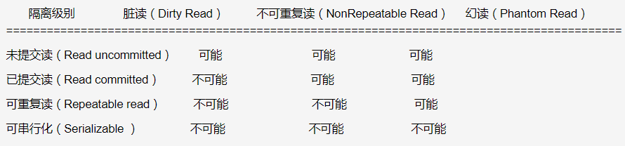

- 事务隔离级别

  

**① 脏读:** 脏读就是指当一个事务正在访问数据，并且对数据进行了修改，而这种修改还没有提交到数据库中，这时，另外一个事务也访问这个数据，然后使用了这个数据。

**② 不可重复读:**是指在一个事务内，多次读同一数据。在这个事务还没有结束时，另外一个事务也访问该同一数据。那么，在第一个事务中的两次读数据之间，由于第二个事务的修改，那么第一个事务两次读到的的数据可能是不一样的。这样就发生了在一个事务内两次读到的数据是不一样的，因此称为是不可重复读。

**④ 幻读:**第一个事务对一个表中的数据进行了修改，这种修改涉及到表中的全部数据行。同时，第二个事务也修改这个表中的数据，这种修改是向表中插入一行新数据。那么，以后就会发生操作第一个事务的用户发现表中还有没有修改的数据行，就好象发生了幻觉一样。

- 存储引擎

  **MyISAM**

  它不支持事务，也不支持外键，尤其是访问速度快，对事务完整性没有要求或者以SELECT、INSERT为主的应用基本都可以使用这个引擎来创建表。
  每个MyISAM在磁盘上存储成3个文件，其中文件名和表名都相同，但是扩展名分别为：

  - .frm(存储表定义)
  - MYD(MYData，存储数据)
  - MYI(MYIndex，存储索引)

  ​        如果表主要是用于插入新记录和读出记录，那么选择MyISAM能实现处理高效率。如果应用的完整性、并发性要求比较低，也可以使用。

  **InnoDB**

  InnoDB事务型存储引擎，还引入了行级锁定和外键约束，在以下场合下，使用InnoDB是最理想的选择：

  1.更新密集的表。InnoDB存储引擎特别适合处理多重并发的更新请求。
  2.事务。InnoDB存储引擎是支持事务的标准MySQL存储引擎。
  3.自动灾难恢复。与其它存储引擎不同，InnoDB表能够自动从灾难中恢复。
  4.外键约束。MySQL支持外键的存储引擎只有InnoDB。
  5.支持自动增加列AUTO_INCREMENT属性。

  ​	如果需要对事务的完整性要求比较高（比如银行），要求实现并发控制（比如售票），那选择InnoDB有很大的优势。

- [mysql中innodb和myisam对比及索引原理区别](https://blog.csdn.net/qq_27607965/article/details/79925288)

  ```
  1. 事务和外键（InnoDB具有事务，支持4个事务隔离级别，回滚，崩溃修复能力和多版本并发的事务安全；MyISAM管理非事务表。它提供高速存储和检索，以及全文搜索能力，执行大量的SELECT查询）
  2. 全文索引（Innodb不支持全文索引）
  3. 锁(MyISAM支持表级锁定，InnoDB支持行级锁，InnoDB表的行锁也不是绝对的，如果在执行一个SQL语句时MySQL不能确定要扫描的范围，InnoDB表同样会锁全表，注意间隙锁的影响 like语句)
  4. 存储（InnoDB表空间数据文件和它的日志文件）
  5. 索引（InnoDB（索引组织表）使用的聚簇索引、索引就是数据，顺序存储，因此能缓存索引，也能缓存数据，MyISAM（堆组织表）使用的是非聚簇索引、索引和文件分开，随机存储，只能缓存索引）
  6. 并发（MyISAM读写互相阻塞：不仅会在写入的时候阻塞读取，MyISAM还会在读取的时候阻塞写入，但读本身并不会阻塞另外的读，InnoDB 读写阻塞与事务隔离级别相关）
  7. 场景选择
  8. 其它细节
  1）InnoDB 中不保存表的具体行数，注意的是，当count(*)语句包含 where条件时，两种表的操作是一样的
  2）对于AUTO_INCREMENT类型的字段，InnoDB中必须包含只有该字段的索引，但是在MyISAM表中，可以和其他字段一起建立联合索引
  3）DELETE FROM table时，InnoDB不会重新建立表，而是一行一行的删除
  4）LOAD TABLE FROM MASTER操作对InnoDB是不起作用的，解决方法是首先把InnoDB表改成MyISAM表，导入数据后再改成InnoDB表，但是对于使用的额外的InnoDB特性(例如外键)的表不适用
  5）如果执行大量的SELECT，MyISAM是更好的选择，如果你的数据执行大量的INSERT或UPDATE，出于性能方面的考虑，应该使用InnoDB表
  
  9.为什么MyISAM会比Innodb 的查询速度快
  InnoDB 在做SELECT的时候，要维护的东西比MYISAM引擎多很多；
  1）InnoDB 要缓存数据和索引，MyISAM只缓存索引块，这中间还有换进换出的减少
  2）innodb寻址要映射到块，再到行，MyISAM记录的直接是文件的OFFSET，定位比INNODB要快
  3）InnoDB 还需要维护MVCC一致；虽然你的场景没有，但他还是需要去检查和维护
  ```

  

- 那为什么推荐使用整型自增主键而不是选择UUID？
  1. UUID是字符串，比整型消耗更多的存储空间；
  2. 在B+树中进行查找时需要跟经过的节点值比较大小，整型数据的比较运算比字符串更快速；
  3. 自增的整型索引在磁盘中会连续存储，在读取一页数据时也是连续；UUID是随机产生的，读取的上下两行数据存储是分散的，不适合执行where id > 5 && id < 20的条件查询语句。
  4. 在插入或删除数据时，整型自增主键会在叶子结点的末尾建立新的叶子节点，不会破坏左侧子树的结构；UUID主键很容易出现这样的情况，B+树为了维持自身的特性，有可能会进行结构的重构，消耗更多的时间。

- B+树做数据库索引

  (1)很适合磁盘存储，能够充分利用局部性原理，磁盘预读；

  (2)很低的树高度，能够存储大量数据；

  (3)索引本身占用的内存很小；

  (4)能够很好的支持单点查询，范围查询，有序性查询；

